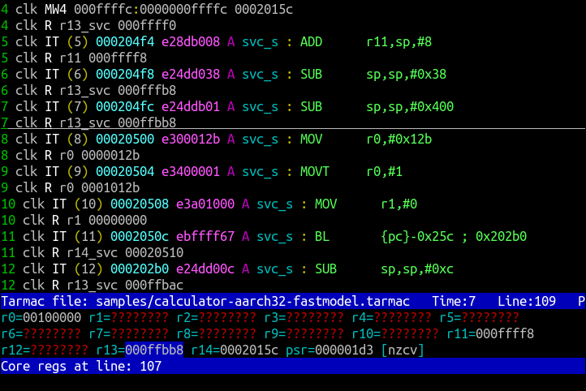
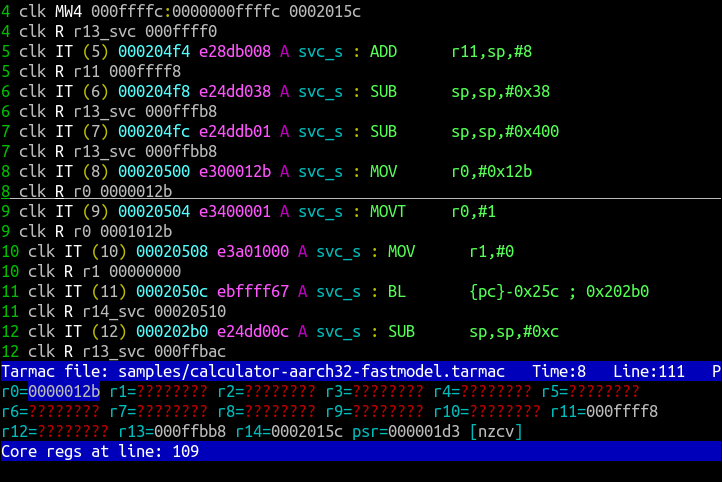
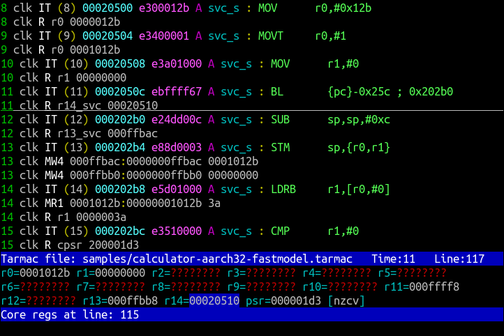
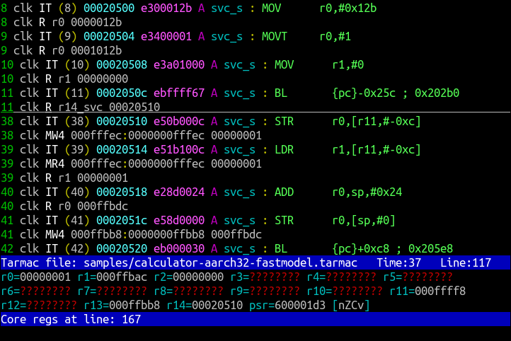
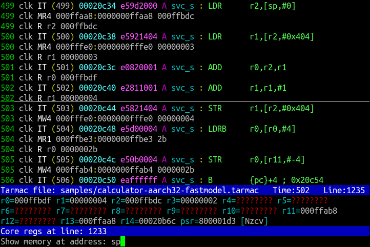
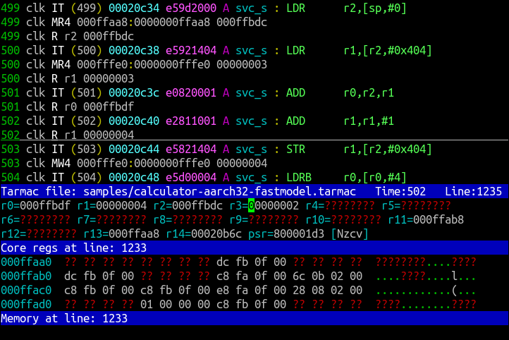
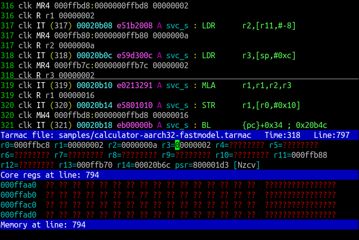
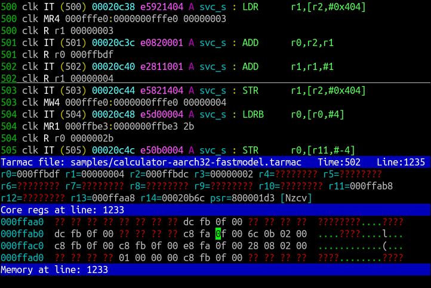
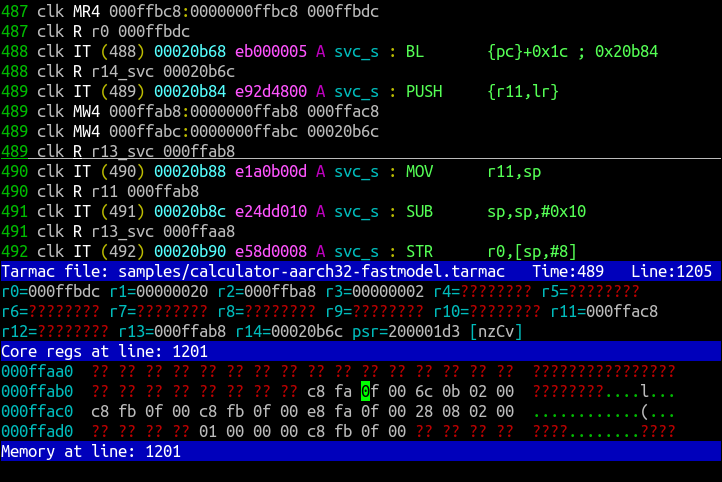

..
  Copyright 2016-2021 Arm Limited. All rights reserved.

  Licensed under the Apache License, Version 2.0 (the "License");
  you may not use this file except in compliance with the License.
  You may obtain a copy of the License at

      http://www.apache.org/licenses/LICENSE-2.0

  Unless required by applicable law or agreed to in writing, software
  distributed under the License is distributed on an "AS IS" BASIS,
  WITHOUT WARRANTIES OR CONDITIONS OF ANY KIND, either express or implied.
  See the License for the specific language governing permissions and
  limitations under the License.

  This file is part of Tarmac Trace Utilities

Arm Tarmac Trace Utilities
~~~~~~~~~~~~~~~~~~~~~~~~~~

Welcome to the documentation for Arm Tarmac Trace Utilities. This is a
suite of tools to read, analyze and browse traces of running programs
in the 'Tarmac' textual format.

.. contents::
   :depth: 3

Introduction
============

Tarmac trace file format
------------------------

Some Arm products -- usually software models of CPUs -- are able to
run in a mode where they generate a detailed trace of a program's
execution. These traces are often written to a text file, in a format
called 'Tarmac'.

Here's an example snippet of a Tarmac file, generated from an Arm Fast
Model:

.. code-block:: none

  53 clk IT (53) 002109f0 f94003e1 O EL3h_s : LDR      x1,[sp,#0]
  53 clk MR8 000ffb80:0000000ffb80 00000000_000ffbb8
  53 clk R X1 00000000000FFBB8
  54 clk IT (54) 002109f4 910083e0 O EL3h_s : ADD      x0,sp,#0x20
  54 clk R X0 00000000000FFBA0
  55 clk IT (55) 002109f8 f90007e0 O EL3h_s : STR      x0,[sp,#8]
  55 clk MW8 000ffb88:0000000ffb88 00000000_000ffba0

Each line of the file begins with a timestamp (in this case, the
``clk`` indicates that it's measured in clock cycles), followed by a
label that indicates the type of trace event described by the line.

The lines labelled ``IT`` show instructions being executed, with their
address in memory, their instruction encoding, and their
assembly-language representation. Also, the ``O`` indicates the CPU
execution state (here AArch64; other letters indicate AArch32 Arm and
Thumb), and the exception level is shown next to that (``EL3h_s``).

The lines labelled ``R`` show a register being updated, with the name
of the register and its new contents.

The lines labelled ``MR8`` and ``MW8`` indicate memory accesses. The
label itself indicates whether the access was a read or a write, and
how many bytes are transferred; the rest of the line shows the
accessed address (both virtual and physical, though in this example,
they're the same), and the data being transferred. (In this case, you
can see that the data loaded by the ``MR8`` line is the same data that
is then written into the destination register ``x1``, as you'd
expect.)

The Tarmac format has diverged considerably since it was invented, and
not all Tarmac traces look like the above example. Here's a different
style of Tarmac, showing the same three instructions being executed:

.. code-block:: none

  0 tic ES  (00000000002109f0:f94003e1) O el3h_s:         LDR      x1,[sp,#0]
            LD 00000000000ffb80 ........ ........ 00000000 000ffbb8    S:00000ffb80    nGnRnE OSH
            R X1 00000000000ffbb8
  0 tic ES  (00000000002109f4:910083e0) O el3h_s:         ADD      x0,sp,#0x20
            R X0 00000000000ffba0
  0 tic ES  (00000000002109f8:f90007e0) O el3h_s:         STR      x0,[sp,#8]
            ST 00000000000ffb80 00000000 000ffba0 ........ ........    S:00000ffb80    nGnRnE OSH

In this style of Tarmac, not every line begins with a timestamp; when
it's missing, the line is taken to have the same timestamp as the
previous one. (In this particular trace, the timestamps also have
lower resolution, so that consecutively executed instructions don't
necessarily have different timestamps from each other.)

You can see that the instruction lines are formatted differently: they
have an ``ES`` rather than ``IT`` label, and although all the same
information is presented, it's all in a different order.

The memory access lines are even more different. Here, each line shows
a base address, followed by a diagram of 16 bytes of memory starting
at that address. Bytes not accessed are written as ``..``, and bytes
that are accessed have the transferred value shown in hex. So in this
example, you can see that the ``LD`` and ``ST`` lines are showing the
*same* 16-byte region of memory, but the load is accessing the
low-order 8 bytes of it (shown on the right, i.e. little-endian), and
the store is accessing the high-order 8 bytes.

Whichever style of Tarmac is in use, the same basic information is
shown:

* all the instructions executed -- and the ones *not* executed, if a
  conditional instruction fails its condition

* all updates to CPU registers: the general-purpose core registers,
  the FP and vector registers if any, and sometimes system registers

* all reads and writes of memory by load and store instructions

* other CPU-level events such as interrupts, CPU exceptions and mode
  changes

* in some cases, events completely outside the CPU, such as status
  reports from the CPU simulation software.

Tarmac Trace Utilities
----------------------

Tarmac Trace Utilities is a suite of tools that can process trace
files in Tarmac format.

The tools in this suite all begin by reading a trace file, parsing it,
and doing preliminary analysis. The analysis tasks include:

* Tracking trace events that show individual changes to registers and
  memory, to build up a reusable representation of the *overall* state
  of registers and memory at every point in the trace.

* Tracking transfers of control that look like function calls, to
  build up a representation of the overall call tree of the traced
  program.

The output of this analysis is an index file. By default this is
written to disk alongside the input trace file. The index file allows
analysis tools to efficiently look up all the outputs of the analysis,
without having to re-parse the trace file repeatedly.

All the tools will generate the same index file in the same way, so
that once the index file exists, you can run more than one of the
tools, or the same one more than once, and the index will not need
rebuilding.

Once the index is written, each tool does something different with it.
For example:

* Generate a report based on the data in the index and trace file. For
  example, `tarmac-calltree`_ will show the whole tree of function
  calls and returns observed during the trace, or `tarmac-callinfo`_
  will report on calls to one particular function.

* Repackage the trace data in a different format. For example,
  `tarmac-vcd`_ will write out a Value Change Dump file (as defined by
  IEEE 1364) showing the same register updates as the input trace file.

* Interactively browse the trace file in a way that understands its
  semantics. `tarmac-browser`_ and `tarmac-gui-browser`_ will display
  the trace file on screen, just like an ordinary file viewer such as
  Linux's ``less``; but, unlike ``less``, they can also show you the
  full (known) state of registers and memory at your current position
  in the trace file, and allow rapid navigation to places of interest,
  such as the previous location where a given data item was updated,
  or the return corresponding to a function call.

Many of the tools offer additional functionality if you provide an ELF
image that corresponds to the program being traced. This allows the
tools to look up symbol names in the ELF file. For example, in that
mode, ``tarmac-calltree`` can list the names of functions being
called, not just the addresses; and the interactive browsing tools can
substitute function names for addresses in the trace disassembly, and
allow you to enter memory addresses symbolically.

Common functionality
====================

..
  These are the options and arguments defined in lib/tarmacutil.cpp,
  which makes them common across all the tools

All the tools in this suite have some command-line syntax in common.

Generally, the command lines of these tools have the form
  *toolname* [ *options* ] *trace-file-name* [ *tool-arguments* ]

in which:

*toolname*
  The name of one of the tools. For example, ``tarmac-callinfo``, or
  ``tarmac-browser``.

*options*
  Command-line options. Some of these are common to all the tools (see
  below), and individual tools can add further options specific to
  that tool.

*trace-file-name*
  The name of a Tarmac trace file to read, index and process.

  ..
    Note that the TarmacUtilityMT class describes a slightly
    different kind of utility that can take multiple trace files as
    input, e.g. to compare them in some way. Utilities derived from
    that class also don't support --index. But at the moment, there
    are no utilities actually using that feature, so there's no need
    to mention that detail here yet.

*tool-arguments*
  Additional command-line arguments specific to the particular tool,
  if it expects any.

The remainder of this section discusses the common command-line
options supported by all the tools.

Options to control indexing
---------------------------

All the tools in this suite work with an index file generated from the
input Tarmac trace. Normally, they will generate an index
automatically if one is not present, or reuse an existing one if it is
present.

If the tool detects that the trace file it's loading has been modified
more recently than the index (for example, because you re-ran your CPU
simulator and it wrote out a new trace file over the top of the old
one), the tool will re-generate the index automatically.

You can override this behavior by using one of the following options:

``--force-index``
  Forces the tool to re-generate the index file, even if it would
  normally not consider it necessary to do so.

``--no-index``
  Forces the tool *not* to re-generate the index file, even if it
  would normally consider that it *was* necessary to do so.

``--only-index``
  Tells the tool to generate the index file and then stop without
  doing anything else.

By default, the index file will be written in the same directory as
the input trace file, and will have the same name with ``.index`` on
the end. For example, if the input trace file name is
``mytrace.tarmac``, then the default index file name will be
``mytrace.tarmac.index``.

If that default is not suitable for you, you can control the name and
location of the index file using the following option

``--index=``\ *pathname*
  Tells the tool to store its index file at the specified pathname.
  This does not change any of the other default indexing behavior: if
  the file in that location does not exist or is older than the trace
  file then it will be generated, otherwise it will be reused, and the
  above options can override that choice.

Options to control interpretation of the trace
----------------------------------------------

``--li``, ``--bi``
  Tells the tool to interpret the trace as if the CPU is operating in
  little-endian or big-endian mode (for ``--li`` or ``--bi``
  respectively). The default is ``--li``.

  The Tarmac format does not include that information, so if you have
  a big-endian trace and run the tool in little-endian mode (or vice
  versa), then the tool will have no way to detect the error. But the
  index's idea of what data is stored where in memory will not match
  the real memory layout when the program actually ran.

.. _`--image`:

``--image=``\ *pathname*
  Tells the tool the location of an ELF image file that corresponds to
  the program being traced. The tool will then know what addresses in
  memory correspond to symbol names defined in the image, and can use
  that information to generate more helpful output.

Options to control verbosity
----------------------------

``-v`` or ``--verbose``
  Tells the tool to be more verbose about what decisions it is making
  and why. In particular, the tool will explain how it decided whether
  or not to re-generate its index file.

``-q`` or ``--quiet``
  Tells the tool to be quieter about what it is doing. In particular,
  this suppresses the progress meter that is displayed by default
  during indexing (if the program is running interactively in a
  terminal or console).

``--show-progress-meter``
  Tells the tool to display a progress meter during indexing, even if
  it thinks it is *not* running interactively in a terminal or console.

Non-interactive tools
=====================

This section describes command-line tools in the Tarmac Trace
Utilities suite that run without user interaction, each producing a
report about a trace file or a translation of it into another format.

tarmac-callinfo
---------------

``tarmac-callinfo`` reports on calls to a specific function or address.

Its command-line syntax looks like this:
  ``tarmac-callinfo`` [ *options* ] *trace-file-name* *address*\ ...

All the options in `Common functionality`_ are supported. No
additional options are recognized by this tool.

The additional argument(s) are as follows:

*address* (optionally more than once)
  The address of a function in the memory of the traced program. If
  you have provided the `--image`_ option, you can replace this with
  the name of a function defined as a symbol in that image.

  You can specify more than one address argument, and
  ``tarmac-callinfo`` will report on them all.

For each address you specify, ``tarmac-callinfo`` will report a
sequence of lines looking like this:

.. code-block:: none

  - time: 123 (line:234, pos:34567)

Each of these lines identifies a call to the address you specified, by
three different methods: the timestamp of the call in the Tarmac
trace, the line number in the trace file, and the exact byte position
in the trace file.

tarmac-calltree
---------------

``tarmac-calltree`` displays the full hierarchy of function calls
identified in the trace.

Its command-line syntax looks like this:
  ``tarmac-calltree`` [ *options* ] *trace-file-name*

All the options in `Common functionality`_ are supported. No
additional options or arguments are recognized by this tool.

When run over a trace file, ``tarmac-calltree`` produces output in an
indented tree structure. Here's an example snippet:

.. code-block:: none

  o t:89 l:283 pc:0x20784 - t:376 l:930 pc:0x20b48 :
    - t:100 l:308 pc:0x207b0 - t:166 l:463 pc:0x207b4
      o t:101 l:310 pc:0x20b4c - t:165 l:458 pc:0x20b80 :
        - t:108 l:328 pc:0x20b68 - t:160 l:447 pc:0x20b6c
          o t:109 l:330 pc:0x20b84 - t:159 l:442 pc:0x20c5c :
            - t:128 l:374 pc:0x20be0 - t:136 l:391 pc:0x20be4
              o t:129 l:376 pc:0x202fc - t:135 l:390 pc:0x20314 :
    - t:248 l:631 pc:0x209a4 - t:284 l:721 pc:0x209a8
      o t:249 l:633 pc:0x20b4c - t:283 l:716 pc:0x20b80 :
        - t:256 l:651 pc:0x20b68 - t:278 l:705 pc:0x20b6c
          o t:257 l:653 pc:0x20b84 - t:277 l:700 pc:0x20c5c :
    - t:321 l:801 pc:0x20b18 - t:357 l:891 pc:0x20b1c
      o t:322 l:803 pc:0x20b4c - t:356 l:886 pc:0x20b80 :
        - t:329 l:821 pc:0x20b68 - t:351 l:875 pc:0x20b6c
          o t:330 l:823 pc:0x20b84 - t:350 l:870 pc:0x20c5c :

Each line of this log beginning with ``o`` represents an interval in
the trace file that corresponds to one particular activation of a
function, from the moment it is called until the moment it returns.

The start and end positions of that function activation are listed, by
timestamp (e.g. ``t:89``) and line number in the trace file
(``l:283``). The program counter at each end of that interval is also
listed: the starting value (e.g. ``pc:0x20784``) is the address of the
start of the function, and the final value (e.g. ``pc:0x20b48``) is
the address of whichever return instruction was executed in this case.

Each line beginning with ``-`` indicates a call from within that
function to another function. All the same information is listed in
this case. The starting PC value (e.g. ``pc:0x207b0``) gives the
address of the call instruction that transferred control to the
subroutine, and the ending PC value (e.g. ``pc:0x207b4``) gives the
address of the instruction where execution resumed in the caller after
the subroutine returned.

Each ``-`` line, representing a call to a function, is immediately
followed by an ``o`` line indented more deeply, recording the
activation of the called function. Then all the calls from within that
function (if any) are listed, at greater depth still.

tarmac-profile
--------------

``tarmac-profile`` prints out simple profiling data derived from the
trace file, showing the amount of time spent in every function.

Its command-line syntax looks like this:
  ``tarmac-profile`` [ *options* ] *trace-file-name*

All the options in `Common functionality`_ are supported. No
additional options or arguments are recognized by this tool.

When run over a trace file, ``tarmac-profile`` produces output in a
tabular form. Here's an example:

.. code-block:: none

  Address     Count       Time        Function name
  0x8000      1           1234
  0x8034      10          1020        foo
  0x8128      22          634         bar

Each line of this table shows an address that was identified as the
entry point of a function in the trace. For each function, the table
lists the number of times it was called and the total time spent in
the function.

If you provide the `--image`_ option, then the symbols in the
specified ELF image are used to map each function address to its
symbolic name. Otherwise, the 'Function name' column will be left
empty.

This tool counts the time spent in each function in the simplest
possible way: for each activation of the function, look at the
timestamps of the call and the return, and take the difference to
decide how long that activation lasted. Then it reports the sum of all
the activation durations for the function.

A consequence of this approach is that the 'Time' listed for each
function *includes* calls to subroutines. (If a function ``outer``
calls a long-running function ``inner``, then the time spent in
``inner`` will be accounted to *both* functions in the output.) So the
entries in the Time column will typically add up to more than the
total running time of the trace.

Also, if a function calls *itself* recursively, then the time spent in
its inner activation will be counted multiple times, because it will
be accounted to both the inner and outer activations. So a highly
recursive function might be reported as taking far more time all by
itself than the overall duration of the trace!

tarmac-flamegraph
-----------------

``tarmac-flamegraph`` writes out profiling data derived from the trace
file, in a format suitable for use with the 'FlameGraph' tools that
can be found at https://github.com/brendangregg/FlameGraph\ .

These tools generate a profile in an interactively browsable graphical
format, in which execution time is plotted against the full call
stack, so that you see not only which *function* in the program is
taking the most time, but *which* path of calls to it takes the time.

The command-line syntax of ``tarmac-flamegraph`` looks like this:
  ``tarmac-flamegraph`` [ *options* ] *trace-file-name*

All the options in `Common functionality`_ are supported. This tool
also recognizes the following additional option:

``-o`` *filename* or ``--output=``\ *filename*
  Tells the tool to write its output to the specified file, instead of
  to standard output.

No additional arguments are recognized by this tool.

When run over a trace file, ``tarmac-flamegraph`` produces output that
can be consumed by the script ``flamegraph.pl`` in the FlameGraph ``git``
repository, to produce an interactive SVG diagram of the profile output.
The simplest way to use the two tools together is to connect them with
a pipe, e.g.

.. code-block:: none

  tarmac-flamegraph mytrace.tarmac | flamegraph.pl > output.svg

If you provide an ELF image via the `--image`_ option, then the output
will contain the symbolic names of functions in the program. If not,
then it will contain hex addresses.

tarmac-vcd
----------

``tarmac-vcd`` translates the trace file into `Value Change Dump
<https://en.wikipedia.org/wiki/Value_change_dump>`_ format.

VCD format is defined by IEEE 1364 (the Verilog standard), as a
standardized format for log files generated by hardware and logic
simulations. A VCD file defines a number of 'variables', and specifies
how they change over time. Typically the variables might represent
particular signals or wires in the hardware being simulated, or values
placed on externally visible address and data buses. Variables can
contain 'don't know' or 'unset' values as well as ordinary data.

VCD format can be consumed in turn by various software tools. An
open-source example of such a tool is `GTKWave
<http://gtkwave.sourceforge.net/>`_, which allows interactive browsing
of a VCD file.

The command-line syntax of ``tarmac-vcd`` looks like this:
  ``tarmac-vcd`` [ *options* ] *trace-file-name*

All the options in `Common functionality`_ are supported. This tool
also recognizes the following additional options:

``-o`` *filename* or ``--output=``\ *filename*
  Tells the tool to write its output to the specified file, instead of
  to standard output.

``--no-date``
  Don't write a creation date record into the VCD file. This makes the
  output file depend only on the input file, so that running the tool
  in the same way twice will produce identical output. (This option is
  useful for test suites.)

No additional arguments are recognized by this tool.

When run over a trace file, ``tarmac-vcd`` produces an output VCD file
containing variables corresponding to:

* the general-purpose machine registers

* the floating-point registers

* the current PC, and a text field indicating what function the PC is
  in (derived from the ELF file, if one is provided using `--image`_)

* the binary encoding of the instruction currently being executed, and
  a text field giving its disassembly

* a simple simulation of a memory bus, with variables for the address
  currently being accessed, the data being transferred, and a one-bit
  indicator of the direction of transfer.

Interactive browsing tools
==========================

As well as the batch-mode tools described in the previous section,
Tarmac Trace Utilities also includes an interactive browsing system.

In some ways, paging through a Tarmac trace is a useful way to debug a
misbehaving program. The whole of a failing execution of the program
is recorded in detail, so there's no need to keep re-running the
program with a different set of breakpoints, as you might do with an
ordinary debugger. When you find an instruction generating wrong
output, you can look further back in the trace to find the input to
that instruction, and keep backtracking in that way until you find the
point where good data went in and bad data came out -- that is, the
location of the bug.

But in other ways, trying to find out what's going on in a Tarmac
trace can be a frustrating experience, if all you have is an ordinary
general-purpose text file viewer such as ``less``. Suppose you find
(say) a multiplication instruction that's generating the wrong output.
One of its inputs must contain the wrong input -- so first you have to
find out which, and then backtrack to the place where that input value
was generated in turn. That involves searching back through the file
for the previous line that wrote each of the input registers, which
isn't easy in ``less`` (you probably need a regular expression). And
trying to find out what was in a particular piece of *memory* is even
harder, because Tarmac lines that describe memory writes can have so
many different forms, and you might easily miss the one you were
looking for.

The Tarmac Trace Utilities interactive browser is intended to solve
this problem. It still lets you page through the Tarmac trace like an
ordinary file viewer, but in addition, it can consult the index file
at every step to find out the whole current state of registers and
memory. So when you find your misbehaving multiply instruction, you
don't have to search back through the trace file by hand: you can see
at a glance what the inputs to that instruction were. Not only that,
but once you've decided which input register contained the wrong
value, the browser can jump immediately to the previous write to that
register, so that you can see what that one was doing in turn.

Memory is treated just the same as registers. The browser can show a
hex dump of everything it knows about memory, and show how that
evolves as you move through the trace and values are loaded and
stored. And if you spot that a piece of memory has a value you think
is wrong, you can jump immediately to the time when that value was
written.

The index file also contains information about function calls and
returns. The browsing tools can use this information to 'fold up' a
whole function call, so that the inside of it is hidden from view, and
you can step forward or backward past it with a single press of an
arrow key, just like stepping over the whole function call in an
ordinary debugger.

tarmac-browser
--------------

``tarmac-browser`` is a terminal-based interactive browser for trace
files.

Its command-line syntax looks like this:
  ``tarmac-browser`` [ *options* ] *trace-file-name*

All the options in `Common functionality`_ are supported. No
additional options or arguments are recognized by this tool.

Demonstration
.............

When ``tarmac-browser`` is running, it shows a display looking
something like this:

.. screenshot of frame 102 from tarmac-browser.ttyrec

The screen is divided into multiple panes. In the top pane you can see
the actual trace file. The horizontal line indicates the current
position the browser is focusing on: in this case, after the ``SUB``
instruction at time 7 and its register update, and before the ``MOV``
at time 8. Navigating with the Up and Down arrow keys will move the
current position around, one instruction at a time.

In the lower pane of the screen, you can see the general-purpose
registers of the simulation. Some of them are marked as unknown,
because no line of the trace file above the current position has shown
a value being written to those registers. Others do have values.

Every time the current position marker moves, the register pane
automatically updates to match. For example, pressing Down from the
position shown above steps the position forwards past the ``MOV
r0,#0x12b`` instruction:

.. screenshot of frame 103 from tarmac-browser.ttyrec

In this image, you can see that ``r0`` has been updated to match the
value moved into it by the ``MOV`` instruction. The blue highlight on
that register indicates that it changed as a result of the most recent
navigation operation.

Moving the cursor a few steps further forward, we can find a function
call:

.. screenshot of frame 134 from tarmac-browser.ttyrec

Pressing the ``-`` key with the cursor in this position will fold up
the function call:

.. screenshot of frame 138 from tarmac-browser.ttyrec

Here, you can see that after the ``BL`` instruction at address
``0x2050c``, the next instruction shown is at ``0x20510``, immediately
after the ``BL`` in memory. In other words, this is the instruction in
the outer function that was executed immediately after the inner one
returned. So now you can step back and forth through the outer
function as if the inner function was a single operation.

You might need to inspect memory as well as registers. Pressing ``m``
will prompt in the bottom line of the screen for you to enter a memory
address, and then open an extra pane pointing at that address.

For example, in this position, I've entered ``sp`` at the prompt, to
examine the memory just above the stack pointer. (Memory addresses
can be given as arithmetic expressions involving the values of
registers, or ELF symbols too if you've provided an ELF file.)

.. screenshot of frame 177 from tarmac-browser.ttyrec

The result is that a third pane has opened, containing a memory dump:

.. screenshot of frame 183 from tarmac-browser.ttyrec

Just like the register dump, some values in memory are unknown because
the trace file has not shown any accesses to them. But the values that
are known are shown in both hex and ASCII.

Pressing the Tab key will cycle the input focus between the panes of
the display. From this position, pressing it once will cause a text
cursor to appear in the register window, where you can move it
backwards and forwards to select an individual register. Suppose I put
the cursor on ``r3``, for example:

.. screenshot of frame 204 from tarmac-browser.ttyrec

Pressing Return at this point will immediately jump the current
position to the previous place where that register value was written:

.. screenshot of frame 226 from tarmac-browser.ttyrec

(Note that after this operation the input focus is still in the
register pane; in order to scroll up and down the trace itself, you'll
need to Tab back to the trace pane first.)

In a similar way, you can do queries for the last time a piece of
memory was written. Let's go back to the previous location, and this
time, put the input focus in the memory window instead of the register
window:

.. screenshot of frame 276 from tarmac-browser.ttyrec

Memory queries are slightly more complicated, because you can specify
what *range* of memory you want to know about. If you want to know why
(say) a 32-bit word at a given position has the value it does, then
you're probably interested in the last write to *any part* of that
word. So you can ask about a whole aligned 4-byte region at once, by
putting the cursor anywhere in it and pressing ``4``. Similarly, you
can press ``1``, ``2`` or ``8`` to ask about a single byte, halfword,
or 8-byte word.

In this case, with the cursor at address ``0xffaba``, pressing ``4``
asks about the last change to the aligned 4-byte word at ``0xffab8``,
and we jump to here, just below a ``PUSH`` instruction that is indeed
writing to that word of memory:

.. screenshot of frame 293 from tarmac-browser.ttyrec

General keyboard commands
.........................

This section describes the top-level controls of ``tarmac-browser``,
common to multiple types of display pane.

Tab
  Switch input focus to a different pane. Pressing Tab repeatedly
  cycles around the visible panes.

F1 or F10
  Display a help screen for the currently active pane. In this mode,
  pressing Up, Down, PgUp or PgDn will scroll around the help, and any
  other key will close the help and return to the previous display.

``q``
  Quit ``tarmac-browser``.

Various keyboard commands in individual panes cause a prompt to appear
in the bottom line of the screen. In those prompts, the following
editing keystrokes are recognized:

Ctrl-W
  Delete one word left of the cursor.

Ctrl-U
  Delete all the text entered so far, and start again from an empty
  input buffer.

Escape or Ctrl-G
  Abandon the prompt and cancel the command that triggered it.

Trace pane commands
...................

This section gives a full list of the keyboard commands available in
the pane showing the contents of the Tarmac trace file.

Up and Down
  Move the current position up or down the file. The unit of movement
  is one *instruction* rather than one line: the current position
  marker will automatically step past all the register and memory
  updates that go with each instruction.

PgUp, PgDn
  Move up or down by a whole screenful.

Home, End
  Go to the top or bottom of the trace file.

Ctrl-L
  Scroll the trace pane so that the current position cycles between
  the middle, top and bottom of the display. The current position
  continues to point at the same instruction.

``-`` (or ``_``)
  Fold up the function call containing the current position.

``+`` (or ``=``)
  Unfold a folded-up function call at the current position, if there
  is one. To use this command, the current position should be
  immediately after the call instruction.

``[``
  Fold up all the subroutine calls from *inside* the function
  containing the current position, but leave that function itself
  unfolded.

``]``
  Unfold everything within the current function, to any depth of
  nesting.

``{``
  Unfold the entire trace file, so that no instructions at all are
  hidden from view.

``}``
  Fold up the entire trace file to the maximum extent possible.

``l``
  Prompt on the bottom line of the screen for a line number, and then
  jump to that line number of the trace file.

``t``
  Prompt on the bottom line of the screen for a time value, and then
  jump to the location in the trace where that timestamp is shown.

``p`` and ``P``
  Prompt on the bottom line of the screen for an address, and the jump
  to the next or previous location in the trace where an instruction
  at that PC was executed. The ``p`` command searches forwards for the
  next visit to that location; ``P`` searches backwards for the
  previous one.

``n`` and ``N``
  Repeat the previous search for a PC value, without prompting again
  for the address to search for. ``n`` searches forwards, and ``N``
  searches backwards.

``m``
  Prompt on the bottom line of the screen for an address, and open an
  additional memory view pane showing the known memory contents at
  that address.

``r``
  Toggle display of the pane showing the general-purpose integer
  registers. If it is currently visible, it is closed; if it is
  currently not visible, it is opened.

``S``
  Toggle display of a pane showing the single-precision floating-point
  registers, with their raw contents in hex and a decimal translation.

``D``
  Toggle display of a pane showing the double-precision floating-point
  registers, with their raw contents in hex and a decimal translation.

``V``
  Toggle display of a pane showing the NEON vector registers.

``M``
  Toggle display of a pane showing the MVE vector registers.

``a``
  Highlight one of the trace lines relating to the instruction just
  before the current position. Pressing ``a`` repeatedly will cycle
  the highlight through all the available lines, and then turn it off
  again. This highlight is used by the Return keystroke, described
  next.

Return
  If the highlight line controlled by the ``a`` key is visible and
  points at a register or memory update, then pressing this key will
  jump to the previous location where that register or piece of memory
  was updated.

  For example, if you can see an ``MR4`` trace line indicating a
  4-byte value being read from memory, then highlighting that line and
  pressing Return will jump to the place where that value was
  previously written to memory.

  (This system provides a shortcut to the more cumbersome process of
  opening up a memory view window, navigating to the right address in
  there, and pressing the right number key.)

F6
  Toggle syntax highlighting of the trace file.

F7
  If an ELF image was provided via the `--image`_ option, then branch
  instructions shown in the trace have their target addresses replaced
  with symbolic names derived from the ELF file. Pressing F7 toggles
  that substitution on and off.

Register and memory panes
.........................

This section lists commands that are common to all the types of pane
displaying the contents of registers and memory.

Up, Down, Left, Right
  Move the cursor around the window to select a particular register or
  particular memory location. In memory views, the window can scroll
  if necessary.

Return
  Jump to the previous trace location that wrote to the currently
  selected register, or byte of memory.

``<`` and ``>``
  Change the height of the currently selected pane by one line. ``<``
  makes the pane shorter, and ``>`` makes it taller.

  This command does not apply to the main pane showing the trace file.
  Register and memory panes can be expanded or reduced by this
  command, and the main trace pane takes up whatever space remains.

``l`` and ``t``
  By default, register and memory panes automatically update their
  contents as you move your current position around the trace file.
  But you can manually lock them to a specific position in the trace
  instead, so that they will continue to show the same data even when
  you navigate around the trace file.

  Pressing ``l`` will prompt for a trace line number, and pressing
  ``t`` will prompt for a timestamp in the trace. After that, the
  window will be locked to the specified position.

Ctrl-L
  If the pane is currently locked to a specific time, this keystroke
  unlocks it, so that it goes back to following the current trace file
  position.

  If the pane is not locked, this keystroke locks it to whatever trace
  position it's currently displaying.

Register panes
..............

In addition to the commands described in `Register and memory panes`_,
the following additional keyboard command is available in register
view panes.

``a``
  Toggle display, in the pane's status line, of a symbolic
  interpretation of the contents of the currently selected register as
  an address.

  This is useful if you've provided an ELF image via `--image`_. Then,
  if the register contains the address of a particular global
  variable, or of a function, then the display in the status line will
  tell you the name of the symbol in question.

Memory panes
............

In addition to the commands described in `Register and memory panes`_,
the following additional keyboard commands are available in memory
view panes.

``[`` and ``]``
  Search forward or backward in memory for the previous or next
  address that is currently highlighted as modified. ``[`` searches
  backwards, and ``]`` searches forwards.

  This is most useful if you have folded up a function call. When you
  move the current position in the trace pane past the folded function
  call, every memory location modified by the function will be shown
  with a blue highlight. But if the function has modified widely
  separated areas of memory, then not all of them will be visible in
  your current memory view.

  So, if you put the input focus into the memory view and press ``[``
  or ``]``, you can easily find all the locations that were modified
  by the function call you just stepped over.

``d``
  Enter a specific line number of the trace file to compare against.

  This command lets you manually control the same highlighting of
  changes that happens automatically when you step over an instruction
  or function call. Using this command, you can specify an exact trace
  position to compare against, and then all the memory changes between
  that position and the currently displayed position are highlighted
  in blue and can be found using ``[`` and ``]``.

``1``, ``2``, ``4``, ``8``
  Jump to the previous trace location that wrote to any part of the
  1-, 2-, 4- or 8-byte aligned memory region under the cursor.

  Pressing ``1`` has the same effect as pressing Return (it's included
  for consistency with the other number keys): it finds the previous
  write to the byte under the cursor. But ``4``, for example, finds
  any write to the aligned 4-byte word containing the cursor, even if
  that write only touched part of the region. Similarly with ``2`` and
  ``8``.

tarmac-gui-browser
------------------

``tarmac-gui-browser`` is a GUI-based interactive browser for trace
files. It provides an alternative user interface on top of the same
functionality as the terminal-based ``tarmac-browser``.

In the current state of the code, ``tarmac-gui-browser`` uses the same
command-line syntax as the rest of the Tarmac Trace Utilities tools.
That is, it must be run with a trace file name on its command line, in
the same style as the terminal-based browser. You can't launch it
without arguments (e.g. from a GUI menu) and then load the trace file
using a GUI file browser.

The command-line syntax looks like this:
  ``tarmac-gui-browser`` [ *options* ] *trace-file-name*

All the options in `Common functionality`_ are supported. No
additional options or arguments are recognized by this tool.

When ``tarmac-gui-browser`` starts up, it will open two windows: one
showing the trace file, and another showing the integer
general-purpose registers. These windows behave similarly to the
initial trace pane and register pane in ``tarmac-browser``: the trace
window shows a horizontal line indicating the current position, and as
you move that line around by arrow key presses or mouse clicks, the
register window updates to show the state of the machine registers at
that position, as far as they can be known from the trace file.

The same functionality is available in ``tarmac-gui-browser`` as in
``tarmac-browser``, but it's all accessed via GUI controls and mouse
gestures:

* The current position in the trace window can be changed by mouse
  clicks as well as arrow keys. Scrolling around the window can be
  done using the GUI scrollbar.

* Jumping to a particular line number or timestamp, or searching for
  visits to a particular PC, can be done using the text boxes in the
  trace window's toolbar.

* A function call can be folded and unfolded by clicking the boxed
  ``+`` or ``-`` signs to the left of the call instruction.
  Right-clicking on any instruction gives a context menu that allows
  further fold options, such as leaving the instruction's containing
  function unfolded but folding up all subroutine calls inside it.

* Opening additional register view windows or memory views can be done
  from the drop-down menus in the trace window.

* To jump to a trace location where a register or memory location was
  last written, right-click on that register or location, and select a
  context menu option. You can do this in register and memory windows
  themselves, or by right-clicking on the associated trace line. (For
  example, right-clicking on a memory read will allow you to find the
  previous write to the same piece of memory.)

An additional feature of ``tarmac-gui-browser`` is that it can open
multiple windows viewing the same trace file, so that you can look at
two parts of it at the same time. Each trace window is given an index
number, shown in its title bar as ``[#1]`` or ``[#2]`` or similar.
Register and memory windows have a toolbar menu showing which of the
current trace windows they are following, so you can re-bind one to a
different one of your trace windows, or decouple it from all of them
and manually fix it to a particular position in the trace.

Technical appendices
====================

Specification of the recognized Tarmac trace format
---------------------------------------------------

Tarmac trace files do not have a single unambiguous specification.
However, this section specifies the format recognized by Tarmac Trace
Utilities.

Basic structure
...............

Each line of a Tarmac file is parsed independently: there is no
large-scale structure spanning multiple lines.

Lexically, a line of Tarmac trace is considered to consist of
multi-character 'words' made up of alphanumeric characters and
``_-.#``, and individual punctuation characters. Whitespace is ignored
except that it separates words.

The overall structure of a Tarmac trace line is as follows:
  [ *timestamp* [ *unit* ] ] *type* [ *line-specific-fields* ]

where the fields are as follows:

*timestamp*
  If present, this is a word consisting of decimal digits, interpreted
  as an integer. It indicates the time at which the event took place
  that this trace line describes.

*unit*
  If present, this is one of the following keywords, stating the units
  in which *timestamp* is measured, which can be either an absolute
  unit of time or a CPU-relative one such as a clock cycle:

  * ``clk``
  * ``ns``
  * ``cs``
  * ``cyc``
  * ``tic``
  
  No processing performed by Tarmac Trace Utilities attaches any
  semantic significance to the choice of unit.

*type*
  This is a mandatory word that indicates what type of event is
  described by this trace line. The types recognized by Tarmac Trace
  Utilities are:

  .. list-table::
     :widths: auto
     :header-rows: 1

     * - Type strings
       - Reference
       - Meaning
     * - ``IT``
       - `Instruction lines`_
       - An instruction that was executed.
     * - ``IS``
       - `Instruction lines`_
       - A conditional instruction that tested its condition and did
         not execute because the condition failed.
     * - ``ES``
       - `Instruction lines`_
       - An instruction that was reached, whether it was executed or
         not.
     * - ``R``
       - `Register lines`_
       - An update to a register.
     * - ``MR1``, ``MR2``, ``MR4``, ``MR8``,
         ``MR1X``, ``MR2X``, ``MR4X``, ``MR8X``,
         ``R01``, ``R02``, ``R04``, ``R08``
       - `Contiguous memory access lines`_
       - A read from memory, represented in contiguous style.
     * - ``MW1``, ``MW2``, ``MW4``, ``MW8``,
         ``MW1X``, ``MW2X``, ``MW4X``, ``MW8X``,
         ``W01``, ``W02``, ``W04``, ``W08``
       - `Contiguous memory access lines`_
       - A write to memory, represented in contiguous style.
     * - ``LD``, ``ST``
       - `Diagrammatic memory access lines`_
       - A read or write to memory, represented as a diagram of a
         16-byte region.

  A line containing any other type keyword is ignored by the Tarmac
  Trace Utilities analysis, on the assumption that the information it
  conveys does not affect the indexing system's model of register and
  memory contents and control flow.

*line-specific-fields*
  Additional text whose meaning depends on the type keyword. For the
  type keywords understood by Tarmac Trace Utilities, see the
  following sections.

Instruction lines
.................

The ``IT``, ``IS`` and ``ES`` event types indicate an instruction that
the CPU reached during execution, and at least *considered* executing.

The ``IT`` and ``IS`` event types have the same format as each other,
whereas the ``ES`` event type uses a different format.

An ``IT`` and ``IS`` event can take either of the following formats:
  [ *timestamp* [ *unit* ] ] *type* ``(`` *index* ``)`` *address* *encoding* *state* *mode* ``:`` *disassembly*

  [ *timestamp* [ *unit* ] ] *type* ``(`` *address* ``)`` *encoding* *state* *mode* ``:`` *disassembly*

An ``ES`` event type looks like this:
  [ *timestamp* [ *unit* ] ] ``ES`` ``(`` *address* ``:`` *encoding* ``)`` *state* *mode* ``:`` [ ``CCFAIL`` ] *disassembly*

The fields are as follows:

*timestamp*, *unit*, *type*
  As described in `Basic structure`_.

  Type ``IT`` indicates that the instruction was actually executed.
  ``IS`` indicates that it was not executed, because it was a
  conditional instruction whose condition was not met.

  Type ``ES`` can indicate either of those possibilities.

*index*
  This field only appears in some versions of this instruction format.
  It is a decimal integer that increments by 1 for each instruction
  logged in the trace file. Tarmac Trace Utilities ignores it.

*address*
  A hex integer giving the address in memory where the instruction
  starts.

  (This is the true address, even in Thumb state: the convention of
  setting the low bit to indicate Thumb, derived from the ``BX``
  instruction, is not used here.)

*encoding*
  A hex integer giving the binary encoding of the instruction.

  In Arm or AArch64 instruction set states, where instructions are 32
  bits wide, this is always 8 hex digits, and it encodes the logical
  value of the instruction encoding (not encoded according to its
  memory endianness). For example, ``MOV r1,#0`` in Arm state is
  represented as ``e3a01000``, and ``MOV x2,#0x400`` in AArch64 is
  represented as ``d2808002``.

  In Thumb, the length of this integer can be either 4 digits or 8
  digits. For a 16-bit Thumb instruction, it encodes a single 16-bit
  integer, again by its logical value rather than its memory
  endianness. For a 32-bit Thumb instruction, the two 16-bit values
  are concatenated, with the one stored first in memory displayed
  first. For example, the 16-bit instruction ``MOVS r0,#0`` is
  represented as ``2000``, and the 32-bit ``MOV r0,#0x101`` is
  represented as ``f2401001``.

*state*
  The instruction set state. ``A`` represents 32-bit Arm; ``T``
  represents Thumb; ``O`` represents AArch64.

*mode*
  The CPU mode, in the sense of privilege / exception levels. The
  representation of this field depends on the variant of the Arm
  architecture. Examples might be ``EL3h_s`` (in Arm v8-A AArch64),
  ``svc_s`` (in Arm v7-A), or ``thread`` (in Arm v6-M). Tarmac Trace
  Utilities ignores this field.

``CCFAIL``
  An optional flag that can appear in an ``ES``-format line,
  indicating that the instruction failed its condition. Not all
  producers of ``ES`` lines emit this flag.

*disassembly*
  A textual disassembly of the instruction, occupying all of the text
  to the end of the line after all the previous fields. The details
  and exact syntax of this can vary a lot depending on the Tarmac
  producer.

Register lines
..............

A register update line looks like this:
  [ *timestamp* [ *unit* ] ] ``R`` *register-name* [ ``(`` *extra-info* ``)`` ] *contents* [ *interpretation* ]

The fields are as follows:

*timestamp*, *unit*
  As described in `Basic structure`_.

*register-name*
  The name of the register being updated. This can be a
  general-purpose integer register, a floating-point register, a
  vector register, or a system register.

  The list of names is therefore open-ended, evolving with the Arm
  architecture. Tarmac Trace Utilities recognizes the following names:

  .. list-table::
     :widths: auto
     :header-rows: 1

     * - ``r0``,...,\ ``r15``
       - The AArch32 core registers.
     * - ``x0``,...,\ ``x30``

         ``e0``,...,\ ``e30``
       - The 64-bit AArch64 core registers.
     * - ``w0``,...,\ ``w30``
       - The 32-bit AArch64 core registers. In some variants of Tarmac
         these are also used to report register updates in 32-bit code
         (via the architecturally defined correspondence between the
         AArch32 and AArch64 registers).
     * - ``s0``,...,\ ``s31``
       - The single-precision floating-point registers.
     * - ``d0``,...,\ ``d31``
       - The double-precision floating-point registers.
     * - ``v0``,...,\ ``v31``

         ``q0``,...,\ ``q31``
       - The 128-bit NEON vector registers. These can also be the MVE
         vector registers.
     * - ``xsp``
       - The AArch64 stack pointer.
     * - ``wsp``
       - The bottom 32 bits of the AArch64 stack pointer.
     * - ``msp``
       - An alias for the AArch32 stack pointer, ``r13``.
     * - ``lr``
       - An alias for the AArch32 link register, ``r14``.
     * - ``sp``
       - Can mean ``r13``, or the AArch64 stack pointer, depending
         on the size of *contents* in the register update line.
     * - ``psr``

         ``cpsr``
       - The processor status register, including the condition flags.
     * - ``fpsr``
       - The AArch64 floating-point status register.
     * - ``fpcr``
       - The AArch64 floating-point control register.
     * - ``fpscr``
       - The AArch32 combined floating-point status and control register.
     * - ``vpr``
       - The Arm v8.1-M MVE vector predicate register.

  Sometimes one of the above names is followed by ``_`` and a suffix,
  indicating which instance of a register is being updated. For
  example, in AArch32, the stack pointer might be shown as ``r13_svc``
  to indicate which of the banked versions of r13 is meant.

  Many other register names are also used by lines of this form.
  Tarmac Trace Utilities does not model those registers in its
  indexing, so it ignores updates to them.

  Register names are case-insensitive.

*extra-info*
  Sometimes the register name is followed by a parenthesized word
  giving additional information. In some variants of Tarmac, this is a
  different way to indicate which of a set of banked registers is
  being accessed. It might also indicate the AArch32 or AArch64
  version of a system register.

  Tarmac Trace Utilities does not use this information.

*contents*
  The data written to the register. This is a hex number, written in
  logical order, representing the raw contents of the register (even
  if it's a floating-point register).

  In some cases, for some registers, the value is broken up into
  multiple sequences of hex numbers by ``:`` separators or spaces.
  These are purely visual separators and have no semantic
  significance.

  Sometimes a register update only specifies part of the new contents
  of the register. This is indicated by specifying some bytes as
  ``--`` instead of a pair of hex digits. The semantics are that those
  bytes of the register are unaffected by the update. For example,
  some RTL simulators will log an update to a floating-point register
  such as ``d0`` or ``d1`` by representing it as a partial update of
  the overlapping vector register such as ``q0``.

*interpretation*
  Some variants of Tarmac follow the raw register value with a more
  human-readable interpretation of its contents. For example, an
  update to the PSR might be followed by a description of which status
  flags are set or clear.

  Tarmac Trace Utilities ignores this information if it is present,
  and has no expectations about its format.

Contiguous memory access lines
..............................

As shown in `Introduction`_, memory access lines in Tarmac traces come
in two very different formats. This section describes the simpler of
the two formats, consisting of an address and just the transferred
data.

A memory access line of this type looks like this:
  [ *timestamp* [ *unit* ] ] *type* [ ``X`` ] *virtual-address* [ ``:`` *physical-address* ] *contents*

*timestamp*, *unit*, *type*
  As described in `Basic structure`_.

  In this format of line, the *type* field encodes the direction and
  size of the memory transfer, and optionally whether it is an
  exclusive access (``LDREX`` and ``STREX``).

  The type field starts with an optional ``M`` (for 'memory'), though
  that is sometimes omitted. Then, the letter ``R`` or ``W`` indicates
  a read or a write. Next, a decimal integer indicates the size of
  data transferred, which can be 1, 2, 4 or 8 bytes. (Sometimes this
  has a leading zero.)

  In some variants of Tarmac, the type word can also be suffixed with
  an ``X``, indicating that the memory access is exclusive. However,
  sometimes this is a separate field following the type.

  For example, ``MR2`` or ``R02`` means a read of 2 bytes, and
  ``MW4X`` means a write of 4 bytes with exclusive access.

``X``
  Indicates that the access is exclusive, if that was not encoded in
  the type word.

*virtual-address*
  The virtual address of the memory being read or written, in hex.

*physical-address*
  Optionally, the physical address corresponding to that virtual
  address.

*contents*
  The data read or written to the memory location. This is a hex
  number, written in logical order, irrespective of storage
  endianness. So if the trace is of a CPU running in little-endian
  mode, then the rightmost two hex digits of this word represent the
  byte stored first in memory, whereas in big-endian mode, they
  represent the byte stored last.

  In some variants of Tarmac, an especially long value has a ``_``
  separator in the middle. This is purely a visual separator and has
  no semantic significance.

Diagrammatic memory access lines
................................

This section describes the more complicated format for recording
memory accesses in Tarmac, involving a diagram of 16 bytes of memory
indicating which ones are accessed.

A memory access line of this type looks like this:
  [ *timestamp* [ *unit* ] ] *type* *virtual-address* *memory-diagram* *extra-info*

*timestamp*, *unit*, *type*
  As described in `Basic structure`_.

  In this format of line, the *type* field encodes the direction and
  size of the memory transfer, and optionally whether it is an
  exclusive access (``LDREX`` and ``STREX``).

  *type* is either ``LD`` to indicate a memory read (load), or ``ST``
  to indicate a write (store).

*virtual-address*
  The virtual address at which the *memory-diagram* is based. This is
  not necessarily one of the bytes actually read or written.

*memory-diagram*
  A representation of 16 contiguous bytes of memory, with 2 characters
  per byte.

  Usually these 32 characters are broken up into four 8-character
  words separated by spaces, but Tarmac Trace Utilities does not
  require this: any collection of words each representing a whole
  number of bytes and adding up to the right total length will be
  accepted.

  The bytes in this diagram are always represented in little-endian
  order, even in a trace of a big-endian program. So the rightmost 2
  characters represent the byte stored at *virtual-address* itself,
  and the leftmost 2 characters represent the byte stored at
  *virtual-address*\ +15.

  The pair of characters representing each byte can take one of the
  following values:

  * Two hex digits, indicating a byte of actual data transferred to or
    from memory.

  * Two dots ``..``, indicating that that byte was not accessed.

  * Two hash characters ``##``, indicating that that byte *was*
    accessed, but the data transferred is unavailable for some reason.

*extra-info*
  The memory diagram in this trace line is usually followed by
  additional fields, e.g. indicating the physical address or
  shareability domain information. Tarmac Trace Utilities ignores
  these.

Identifying function calls in a trace
-------------------------------------

The Tarmac Trace Utilities analyzer will try to identify function
calls and returns in an execution trace. The interactive browsers can
use this for folding up a whole function call to step over in one go;
other utilities, such as `tarmac-calltree`_, use that information as
part of their output.

Function calls in the Arm architecture can't be identified with
perfect exactness, so the analyzer has to employ a heuristic. This
appendix documents the heuristic and its rationale.

The problem
...........

At first glance, the problem doesn't *look* hard. A superficial
analysis, and one that is right *most* of the time, would say:

* A direct function call is written as ``BL``.

* An indirect one as ``BLX`` (AArch32) or ``BLR`` (AArch64).

* The return instruction in AArch64 is ``RET``.

* For AArch32, returns are either ``BX lr``, or any ``POP``
  instruction that has ``pc`` in its register list.

* Any function call or return will look like one of those.

* Conversely, anything that looks like one of those is a function call
  or return.

However, there are several reasons why that's not quite right.

**Not all BL instructions are function calls**
  In versions of Thumb without the Thumb-2 wide instructions (e.g. Arm
  v6-M), ``BL`` is sometimes used as a long-distance branch *within* a
  function, simply because it has longer range than ``B``. The value
  written into the link register is simply ignored, and treated as
  arbitrary register corruption by the compiler or the assembly
  programmer, who will simply avoid having any useful value live in
  that register across such a branch.

**Not all BX lr instructions are function returns**
  ``BX`` is sometimes used within a function, for purposes such as
  table branches (typically in versions of the architecture before the
  dedicated table branch instructions). The operand can be any
  general-purpose register that happened to be convenient -- including
  ``lr``!

**Function calls can be multiple-instruction sequences**
  In versions of Thumb before the ``BLX`` instruction was introduced,
  indirect function calls were sometimes performed by manually loading
  the correct return address into ``lr``, and then issuing a
  non-linking ``BX`` instruction. So the two effects of the function
  call (loading ``lr`` and transferring control) didn't even happen in
  the *same* instruction.

**Old-style non-interworking adds more alternatives**
  In early versions of the Arm architecture (Arm v3), the Thumb
  instruction set state did not exist at all, and neither did the
  ``BX`` instruction for branching between Arm and Thumb. In the
  earliest versions *with* Thumb, interworking between Arm and Thumb
  was not zero-cost, so users sometimes chose not to do it.

  For both reasons, this means that sometimes function calls and
  returns are not done using ``BX``, but by other instructions that
  transfer values into ``pc``. For example, in Arm v3 the standard
  non-popping function return instruction was ``MOV pc,lr``, instead of
  ``BX lr``. Similarly, a non-interworking indirect call could be done
  by ``MOV pc,rN``, having preloaded ``lr`` in advance.

**Stunt function calls can manually load a different return address**
  In handwritten assembly, it's sometimes convenient to call a
  function in a way that deliberately gives it a return address
  pointing at something other than the very next instruction.

  For example, a case like this comes up in the Arm Compiler 6 C
  library scatter-loading code, which loops over an array, loading a
  function pointer from each array element and calling them in
  sequence. The function call code sets up ``lr`` to return directly
  to the top of the loop, instead of returning to the next instruction
  and having to branch back there.

  This is an important special case for people debugging traces of Arm
  Compiler output, because those particular function calls contain
  some of the longest and most boring code you can find in a Tarmac
  trace (zeroing or copying large areas of memory). So you
  *especially* want to skip over them during interactive browsing!

**Tail calls**
  In both handwritten assembly and compiler output, a function
  sometimes transfers control to another using a simple jump
  instruction, so that the second function will return directly to the
  first function's caller.

  The function call analyzer has no way to detect this at all, because
  it looks exactly like a transfer of control between basic blocks
  within the same function. So the tail-called function will never
  appear in the call tree at all: it will look as if the whole
  execution of the second function was part of the first.

The solution
............

From the above discussion, we can see that it's not actually possible
to look at an instruction, or a short instruction sequence, and decide
on the basis of purely local information whether it's a function call
or not.

However, Tarmac Trace Utilities has the great advantage that it
doesn't *need* to decide on the basis of purely local information. It
can see the whole execution trace, and effectively travel backward and
forward in time in order to figure out what happened!

So we adopt a strategy in which an event can be *tentatively* tagged
as a potential function call -- and then, if we later see an event
that looks like a matching return, we promote the 'tentative function
call' to a definite one.

Specifically:

To avoid becoming confused by the various different possible
instruction sequences for calls and returns, we focus on *transfers of
control*, rather than particular instructions. The events we consider
as possible calls and returns are any situation in which two
consecutively executed instructions are not consecutive in memory.

A transfer of control is considered to be a potential function call if
both of the following conditions are met:

* The link register ``lr`` was written within the previous 8
  instructions of the trace.

* The value of ``lr`` at the time of the transfer of control is within
  64 bytes of the 'natural' return address (i.e. the address
  immediately after the branch instruction).

Once a transfer of control has been noted as a potential function
call, it is upgraded to an *actual* function call if a later transfer
of control looks like a matching return. This occurs if all of the
following conditions are met:

* The address to which control is transferred matches the value of
  ``lr`` at the potential call.

* The value of ``sp`` after the potential return matches the value of
  ``sp`` before the potential call.

* At no intervening time in the trace has ``sp`` held a value strictly
  larger than that common value.

Rationale for this heuristic:

The time bound of 8 instructions, and the space bound of 64 bytes, are
*mostly* arbitrary. 8 instructions ought to be a large enough window
to recognize any common multiple-instruction function-call sequence,
and it's also large enough to recognize the manual ``lr`` setup in the
Arm Compiler scatter-loading code, mentioned above. 64 bytes is also
enough to recognize the same unusual operation, in which the manually
set up return address is a few instructions away from the natural one.

It is deliberate, however, to have a time *and* a space bound on the
most recent update of ``lr`` for identifying potential function calls.

If you only use a space bound (i.e. any transfer of control in which
``lr`` contains a nearby address to the source point), you get a big
problem with false positives. In practice, ``lr`` often has values
near the currently executing instruction (typically because a previous
function call has just returned, and the address it returned to is
still in ``lr``). So with only a space bound, it's very easy for a
transfer of control *within* a function to be falsely tagged as a
potential call, and then the next *real* function return to that
address can be misidentified as a return from this false-positive
transfer instead of from the sensible function call.

Conversely, if you only use a *time* bound, then ``lr`` will very
often have been updated near to a branch instruction, simply because
inside a function, compiler code generation often uses it as a
general-purpose register!

Semihosting support
-------------------

Semihosting is a facility provided by some Arm CPU models and
development hardware, in which a limited system-call interface is made
available by the debugging environment to allow code running on the
bare metal to perform I/O on the debug host.

When a semihosting operation performs input, the results are written
to the memory of the Arm system. For example, the ``SYS_READ``
semihosting operation behaves very like the Unix ``read`` system call:
the caller passes a pointer to a buffer, and some part of that buffer
is filled with the data read from the debug host.

Some producers of Tarmac trace data, including Arm Fast Models, treat
semihosting operations as their own special kind of event, different
from an ordinary memory write. As a result, the data written into
memory by a semihosting input operation is not logged in the Tarmac
file in the usual way.

Tarmac Trace Utilities deals with this, at indexing time, by
recognizing each specific machine instruction that corresponds to a
semihosting call, and figuring out what region of memory (if any) that
call potentially writes to. Then, after the semihosting call, that
memory is marked as having an *unknown* value: the indexer has reason
to believe that the contents it had before the call is no longer
valid, but the trace does not contain enough information to know what
the new contents are.

Usually, this won't cause a problem, because typically after issuing a
semihosting input call, the program being traced will *read* the
memory that the call wrote to. So when the trace analyzer reaches
those read operations, it will find out what the semihosting call must
have written to memory. And it will 'back-date' that memory contents
in the index, so that the index shows those memory contents appearing
at the moment of the semihosting call.

So, in normal usage, if you use the interactive Tarmac browser on a
program that performs semihosting input, you should see the right data
appearing in memory when you step over the semihosting call
instruction, *even though* the trace does not explicitly list that
memory being written at the time.

For more information, the full specification for semihosting is
available at https://github.com/ARM-software/abi-aa/releases\ . The
relevant parts of it for these purposes are summarized below.

Tarmac Trace Utilities recognizes the following instructions as
semihosting calls:

* In AArch32 Arm state: ``SVC #0x123456`` or ``HLT #0xF000``.

* In AArch32 Thumb state: ``SVC #0xAB``, ``BKPT #0xAB`` or ``HLT #0x3F``.

* In AArch64: ``HLT #0xF000`` only.

In any semihosting call, the register ``r0`` or ``x0`` contains a code
indicating which operation is requested. ``r1`` or ``x1`` usually
contains a pointer to a block of memory. If more than one parameter is
needed for the function, then that block in turn stores the remaining
parameters.

Tarmac Trace Utilities recognizes the following semihosting operations
as potentially generating undeclared writes (that is, not described in
the trace output) to a region of memory:

``0x06`` (``SYS_READ``)
  The parameter block contains three words ``(file, buffer, length)``.
  The region of ``length`` bytes starting at ``buffer`` is marked as
  unknown.

``0x0D`` (``SYS_TMPNAM``) and ``0x15`` (``SYS_GET_CMDLINE``)
  For both of these calls, the parameter block contains two words
  ``(buffer, length)``. The region of ``length`` bytes starting at
  ``buffer`` is marked as unknown.

``0x16`` (``SYS_HEAPINFO``)
  The parameter block contains just one word ``buffer``, which is the
  address of the output buffer. The region of 4 words starting at
  ``buffer`` is marked as unknown. (That is, 16 bytes in AArch32, or
  32 bytes in AArch64.)

``0x30`` (``SYS_ELAPSED``)
  In this operation, the parameter block *itself* is overwritten with
  two output words. So in AArch32, the region of 8 bytes starting at
  the address in ``r1`` is marked as unknown. In AArch64, it's the
  region of 16 bytes starting at the address in ``x1``.

All the other semihosting calls require no special handling, because
they only *read* the memory of the Arm CPU, rather than writing it.
